# **_Writing and Presentation Test Week 1_**

---

## Hari ke - 1 : Unix Command Line

### Shell

“Shell” adalah istilah UNIX untuk commnd-line interfaces antara user dan sistem — cara user berinteraksi langsung dengan komputer menggunakan keyboard dan monitor.

### Fungsi Shell

- Menangani file dan direktori
- Membuka dan menutup program
- Mengelola proses komputer
- Menjalankan task berulang

### Command Line

Jenis shell yang berbasis teks

### Command Line Interface (CLI)

Tempat dimana user bisa mengetikkan perintah dalam bentuk teks dan memberikan instruksi pada komputer untuk mengerjakan tugas tertentu.

### Cara Mengakses CLI Menggunakan Terminal

Sebenarnya kita bisa mengakses CLI kita bisa menggunakan **SH**, **ZSH**, **CMD**. Tapi agar lebih mudah disini saya menggunakan **_Git Bash_**.

### File System

Mengatur bagaimana data disimpan didalam sebuah system. OS Windows & Unix-like biasanya menyusun file dan direktori menggunakan struktur yang bentuknya mirip dengan pohon / tree.

**Contoh :**


### Command untuk Navigasi

- `pwd` Print working directory : Command untuk melihat current working directory.
- `ls` Lists : Command untuk melihat isi file yang ada di sebuah direktori.
- `cd` Change Directory : Command untuk berpindah direktori.

### Membuat files & direktori

- `touch` Command untuk membuat sebuah file.
- `mkdir` Command untuk membuat sebuah direktori.

### Melihat isi files

- `head` Command untuk melihat beberapa line awal dari sebuah file text.
- `tail` Command untuk melihat beberapa line awal dari sebuah file text.
- `cat` Command untuk melihat isi sebuah file.

### Menyalin, memindahkan, dan menghapus files & directory

- `cp` Command untuk mengcopy files atau directory
- `cp -R` Command untuk menyalin directory.
- `mv` (move) Command untuk memindahkan files atau directory. Bisa juga digunakan untuk rename.
- `mv -R` Command untuk memindahkan directory
- `rm` Command untuk menghapus file atau directory.
- `rm -R` atau `rm -d` Command untuk menghapus directory.

## Hari ke - 1 : Git & Github Dasar

### Pengenalan Git

- GIT adalah Tools untuk programmer.
- GIT sebagai Version Control System.

  Apa itu Version Control System ? Tugasnya adalah mencatat setiap perubahan pada File (termasuk code yang kita buat) pada suatu proyek baik dikerjakan secara individu maupun tim.

### Git & Github

- **Git** adalah aplikasi yang dapat melacak setiap perubahan yang terjadi pada suatu folder atau file. Git biasanya digunakan oleh para programmer sebagai tempat penyimpanan file pemrograman mereka, karena lebih efektif.Didalam Git ada 3 stage yaitu Working Directory -> Staging -> Commit.

- **Github** adalah situs web juga sebuah layanan cloud yang bisa membantu para pengguna untuk menyimpan,mengelola dan mengembangkan.

### Kenapa Git & Github Wajib digunakan?

Karena **Git & Github** dapat digunakan untuk berkolaborasi untuk mengerjakan project tanpa perlu mengirim file secara offline / Copy Paste dan Juga dapat memulai kolaborasi tanpa menunggu satu sama lain.

### Instalasi GIT

- [Download](https://git-scm.com/downloads) Git dan jalankan hasil download GIT kamu seperti instal aplikasi pada umumnya

### Cek Apakah Instalasi Berhasil

```
git --version
```

### Setup Awal GIT

- Konfigurasi Git

```
git config --global user.name "Naza Zulfiqi"
git config --global user.email zulfiqinaza@gmail.com
```

\***_Harus menggunakan Username dan Email yang sama dengan Github_**

### Cek Apakah Setup Awal Berhasil

```
git config --list
```

### Repository GIT

- Repository adalah direktori proyek yang kita buat. 1 Repo = 1 Proyek = 1 Direktori

- Membuat Repository

```
git init namafolder
```

#### Git Status

```
git status
```

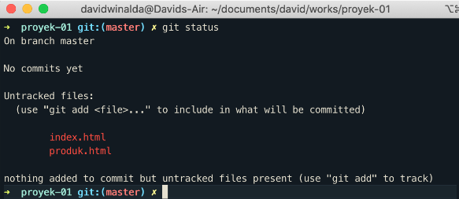

- Modified Modified merupakan kondisi dimana revisi atau perubahan sudah dilakukan, tetapi belum ditandai (untracked) dan belum disimpan dalam version control.
- Staged Staged merupakan kondisi dimana revisi sudah ditandai (modified) namun belum disimpan di version control.
- Committed Commit/Committed merupakan kondisi dimana revisi sudah disimpan pada version control.

#### Git Add

Setelah cek status dengan ‘git status’, selanjutnya kita ubah status ‘untrackted file’ dan ‘unmodified’ menjadi modified dengan cara :

```
git add namafile
```

**Atau**

```
git add .
```

#### Git Commit

Digunakan untuk save perubahan pada version control yang telah dimasukkan kedalam staging area.

```
git commit -m "pesan"
```

#### Git Log

Digunakan untuk melihat riwayat/catatan commit yang telah dilakukan.

```
git log --oneline
```

### Git Branch

Digunakan untuk membuat percabangan,biasanya jika ada fitur baru tetapi belum pasti agar tidak mengganggu branch main

```
git branch namaBranch
```

### Git Checkout

Digunakan untuk kembali ke commit yang dimau atau berpindah branch

- Untuk Kembali Ke Commit

```
git checkout hashCommit
```

- Untuk Berpindah Branch

```
git branch namaBranch
```

### Mempublish Aplikasi Ke Github

Setelah membuat Repository didalam Git kita bisa mempublish repository tersebut kedalam Github.

1. Klik icon "+" di Github lalu pilih New Repository

   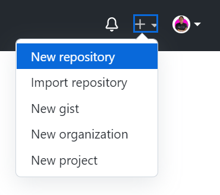

2. Isi nama project sesuai nama repo yang dibuat di Git sebelumnya

   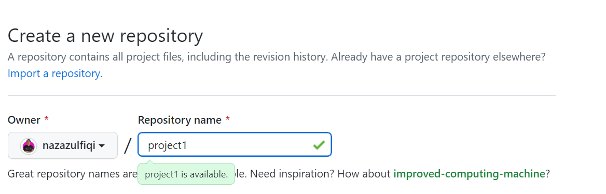

3. Jika sudah klik create repository

   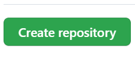

4. Kembali ke Git Bash (Repository Git yang ingin dipublish), Lalu ketik

```
git remote add origin https://github.com/nazazulfiqi/project1.git
git branch -M main
git push -u origin main
```

### Melakukan Cloning dari Github ke Local

1. Cari Repo Github yang Ingin Dicloning,Lalu Copy link https

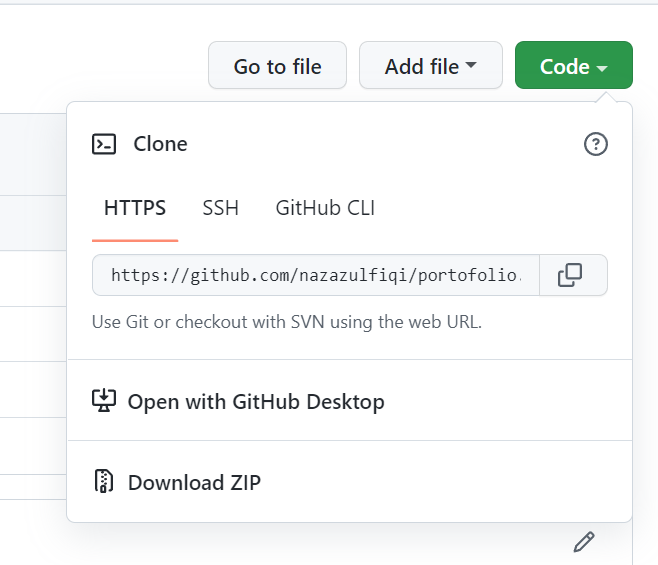

2. Buka Github Lalu Ketikkan

```
git clone https://github.com/nazazulfiqi/portofolio.git
```

3. File Sudah Ada di Local

## Hari ke - 2 : HTML

HTML (HyperText Markup Language) bukanlah suatu bahasa pemrograman tetapi Markup Language yang menggunakan tanda-tanda tertentu (tag) untuk menyatakan kode-kode yang harus ditafsirkan oleh browser agar halaman tersebut dapat ditampilkan secara benar. HTML juga bisa dibilang suatu kerangka untuk membuat website.

### Tools Pendukung HTML

- Browser

  Contoh : Mozilla Firefox, Microsof Egde, Google Chrome

  _Disarankan Google Chrome_

- Code Editor

  Contoh : VSCode, Notepad, Sublime Text

  _Disarankan VSCode_

### Struktur HTML Sederhana

```html
<!DOCTYPE html>
<html lang="en">
  <head>
    <meta charset="UTF-8" />
    <meta http-equiv="X-UA-Compatible" content="IE=edge" />
    <meta name="viewport" content="width=device-width, initial-scale=1.0" />
    <title>Document</title>
  </head>
  <body></body>
</html>
```

- HTML tersusun sebagai kesatuan dari sebuah tingkatan (family tree relationship).
- Saat sebuah element berada di dalam element lain, maka disebut child element.
- Element yang berada diatas element lain disebut parent element.

### Cara Menjalankan file HTML

- Dengan Default Browser,Klik Kanan Pada File Html lalu **Open In Default Browser**

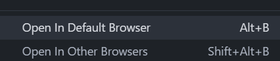

- Dengan Live Server
  Live Server merupakan extension pada VSCode yang dapat merefresh browser secara otomatis.

1. Pilih Icon Extension , Lalu Cari Live Server

   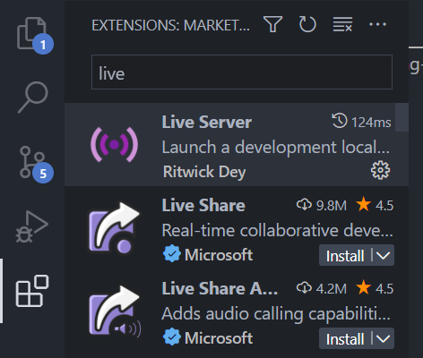

2. Klik Install

   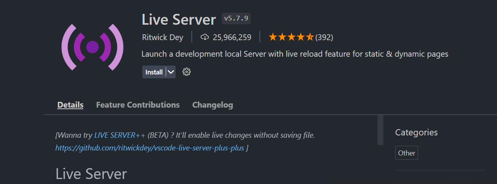

3. Jika Sudah, Buka File Html -> Klik Kanan -> Open With Live Server

   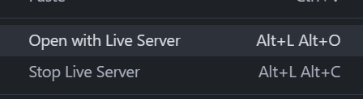

### Tag HTML Populer

`img` Kita bisa menampilkan gambar melalui file lokal komputer kita atau menggunakan link dari internet.

`<b>` dan `<i>` Membuat tulisan tebal dan miring.

`<a>` untuk link.

`<p>` Membuat paragraf.

`<button>` Membuat Tombol

`<h1>`, `<h2>`, `<h3>`, `<h4>`, `<h5>`, `<h6>` Membuat heading.

`form` Membuat formulir.

dan lain-lain.

## HTML Semantic

Semantic HTML adalah menggunakan element html yang sesuai dengan kebutuhan konten.

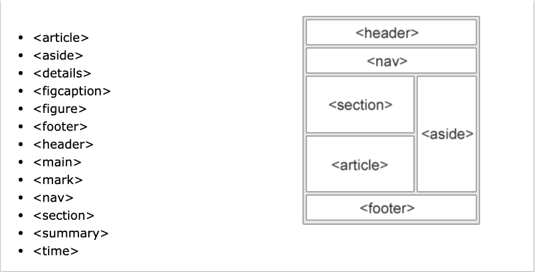

**Contoh Menggunakan Semantic Article & Header :**

```html
<article>
  <header>
    <h1>What Does WWF Do?</h1>
    <p>WWF's mission:</p>
  </header>
  <p>
    WWF's mission is to stop the degradation of our planet's natural
    environment, and build a future in which humans live in harmony with nature.
  </p>
</article>
```

### Fungsi Semantic HTML

- Meningkatkan Accessibility
- Meningkatkan SEO
- Lebih mudah di maintain

### Deploy

Deploy adalah sebuah proses untuk menyebarkan aplikasi yang sudah kita kerjakan supaya bisa digunakan oleh orang-orang. Jika aplikasi kita HTML atau Web App kita perlu mendeploy ke server. Sedangkan jika aplikasi kita mobile seperti Android Atau IOS kita bisa deploy ke Google Play Store atau App Store. Cara mendeploy di **Netlify** :

1. Kita tinggal masuk ke [netlify.com](https://netlify.com)
2. Register seperti biasa menggunakan email atau github.
3. Setelah itu masuk ke tab Sites lalu drag and drop seluruh folder html kalian.

## Hari ke - 3 : CSS

CSS adalah bahasa komputer yang digunakan untuk menambahkan design ke suatu halaman website di internet. Jadi HTML merupakan 'Kerangka' nya dan CSS merupakan 'Baju' nya.

### Ada 3 cara untuk menyisipkan CSS ke dalam HTML, yaitu:

1. Inline CSS, yaitu menggunakan attribute style untuk menyisipkan kode CSS langsung di dalam HTML element.

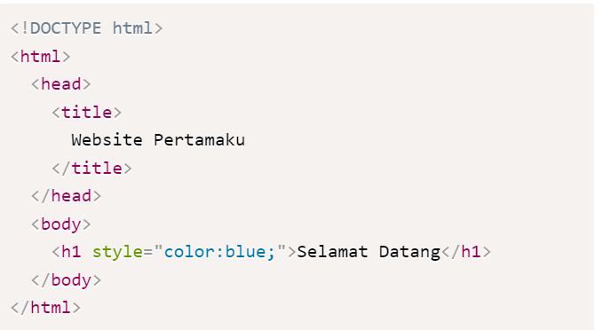

2. Internal CSS, yaitu menggunakan element `<style>` untuk menyisipkan kode CSS. Element `<style> ` tersebut diletakkan di dalam element.

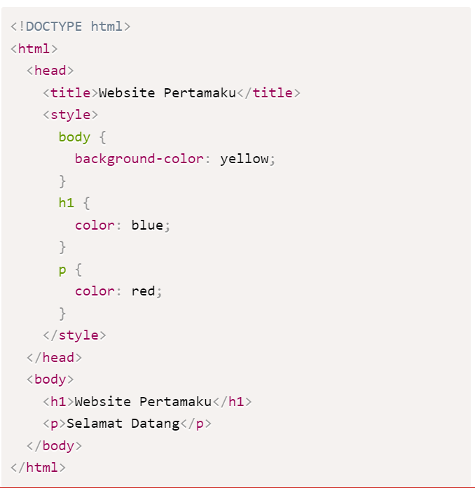

3. External CSS, yaitu sebuah file CSS terpisah yang disambungkan dengan file HTML dengan menggunakan element `<link>`.

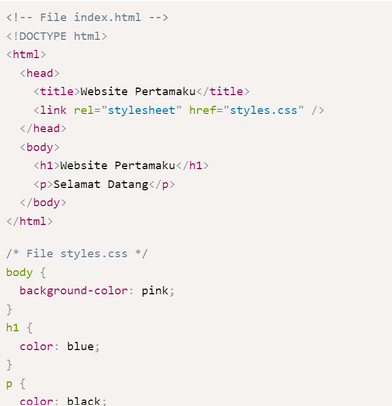

### Struktur CSS

CSS memiliki bebrapa struktur untuk dapat memberi styling pada HTML

`selector` : fungsi yang digunakan memilih tag html untuk diberikan styling

`property` : fungsi apa yang diterapkan pada tag html

`value` : isi dari yang di berikan pada tag html

```css
  h1 { // Selector
color //Properti: red;//Value
}
```

### Styling CSS

`class` Penanda / Selector dengan tipe mirip dengan grup.

```html
<p class="nama">Naza Zulfqi</p>
<p class="nama">Zidane Arvito</p>
```

```css
.nama {
  color: red;
}
```

Kedua Paragraf diatas akan berwarna merah.

`id` Penanda / Selector dengan tipe ini sangat khusus karena spesifik,penamaan `id` tidak boleh sama.

```html
<section id="hero"></section>
```

```css
#hero {
  background-color: #fff;
}
```

### Multiple CSS

Menseleksi lebih dari 1 selector didalam 1 baris.

```css
p,
#hero {
  color: red;
}
```

### Box Model

Semua HTML element itu dianggap sebagai sebuah kotak (box). Karena hal inilah istilah box model muncul. Box model sendiri bisa kalian anggap sebagai kotak yang membungkus setiap HTML element.

**Box model terdiri dari:**

`margin` yaitu area terluar yang kosong setelah border. Margin bersifat transparan.

`border` yaitu garis tepi yang membungkus padding dan konten.

`padding` yaitu area kosong di antara konten dan border. Padding bersifat transparan.

`content` yaitu konten (value/nilai) dari HTML element. Bisa berupa teks, gambar, video, ataupun suara.

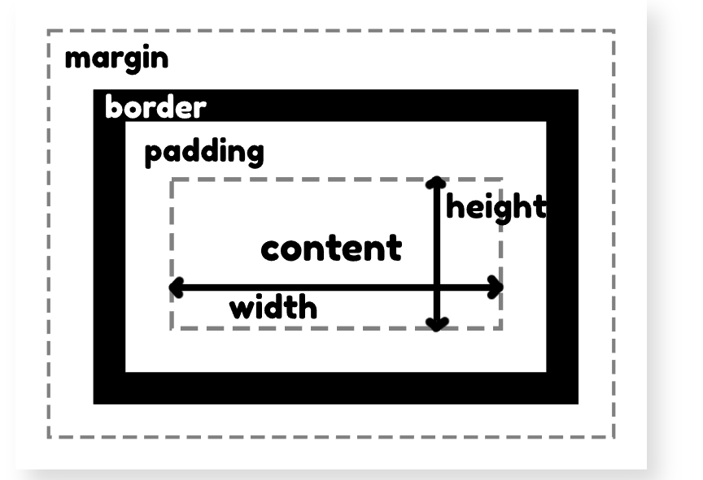

### CSS Display

- Display Block

  Menempati satu baris penuh (atau bahkan beberapa baris) meskipun kontennya tidak sebesar itu.

  ```css
  display: block;
  ```

- Display Inline

  Akan membuat ukuran box dari element tersebut tidak lagi sebaris penuh seperti dalam kasus display: block, melainkan hanya sebesar konten di dalamnya saja.

  ```css
  display: inline;
  ```

- Display Inline-Block

  Secara default hanya akan mengambil ruang sebesar konten di dalamnya.

  ```css
  display: inline-block;
  ```

### Position CSS

Position merupakan property css yang digunakan untuk menentukan sifat posisi suatu elemen di suatu dokument. Sifat di sini dalam artian elemen bisa berubah, tetap , dan lain lain.

`Static` : Default position yang merupakan lapisan paling bawah.

`Fixed` : Lapisan Position mutlak yang tidak akan berubah dan relatif terhadap viewport

`Relative` : Lapisan diatas static yang dapat kita beri properti top, left, right, bottom untuk dapat berpindah-pindah dari posisi awal.

`Absolute` : Lapisan position yang akan mengikuti relative parent terdekat dan menempel diatasnya.

`Sticky` : Lapisan position yang akan berubah menjadi fixed saat kita melakukan scrolling.

### Responsif Media Query

Dengan menggunakan media query, kita bisa mengatur lebar suatu element dan/atau memberikan style lain yang berbeda-beda sesuai dengan ukuran dari browser.

**Contoh :**

```html
<!DOCTYPE html>
<html>
  <head>
    <style>
      body {
        max-width: 800px;
      }
      .button-group {
        display: flex;
      }
      button {
        font-size: 25px;
        width: 100%;
      }
    </style>
  </head>

  <body>
    <h1>Cat Ltd.</h1>
    
    <div class="button-group">
      <button>Talk to Us</button>
      <button>Download Syllabus</button>
      <button>Be a Partner</button>
      <button>Join Class</button>
    </div>
  </body>
</html>
```

```css
@media (max-width: 600px) {
  .button-group {
    display: flex;
    flex-direction: column;
  }
}
```

### FlexBox

Flexbox / Flexible Box memudahkan para programmer untuk mengatur layout, posisi, dan ukuran dari tiap element di dalamnya.

**Contoh Tidak Memakai FlexBox :**

```html
<!DOCTYPE html>
<html lang="en">
  <head>
    <meta charset="UTF-8" />
    <meta http-equiv="X-UA-Compatible" content="IE=edge" />
    <meta name="viewport" content="width=device-width, initial-scale=1.0" />
    <title>Document</title>
    <link rel="stylesheet" href="style.css" />
  </head>
  <body>
    <div class="container">
      <div class="item">1</div>
      <div class="item">2</div>
      <div class="item">3</div>
      <div class="item">4</div>
      <div class="item">5</div>
      <div class="item">6</div>
      <div class="item">7</div>
      <div class="item">8</div>
      <div class="item">9</div>
    </div>
  </body>
</html>
```

```css
.item {
  width: 200px;
  height: 200px;
  background-color: aqua;
  margin: 5px;
}
```

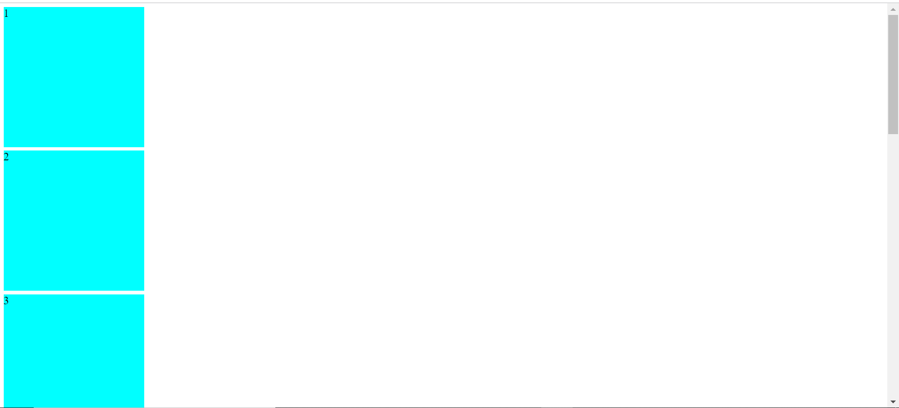

**Contoh Memakai Display Flex :**

```css
.container {
  display: flex;
}
```

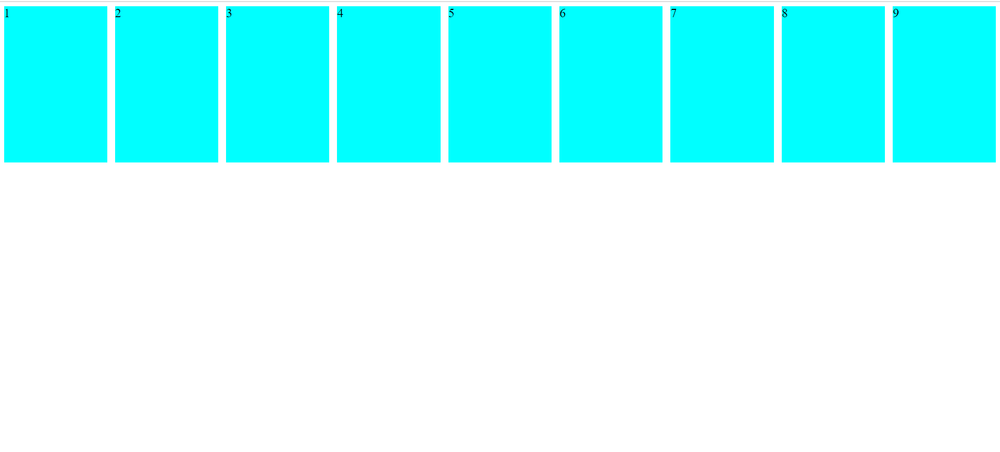

### Flex Direction

`row` (default) : Secara default Membentuk sebuah baris dari kiri ke kanan.

`row-reverse` : Membentuk sebuah baris dari kanan ke kiri.

`column` : Membentuk sebuah baris dari atas ke bawah.

`column-reverse` : Membentuk sebuah baris dari bawah ke atas.

**Contoh Flex Direction `row` default :**

```css
.container {
  display: flex;
  flex-direction: row;
}
```


**Contoh Flex Direction `row-reverse` :**

```css
.container {
  display: flex;
  flex-direction: row-reverse;
}
```

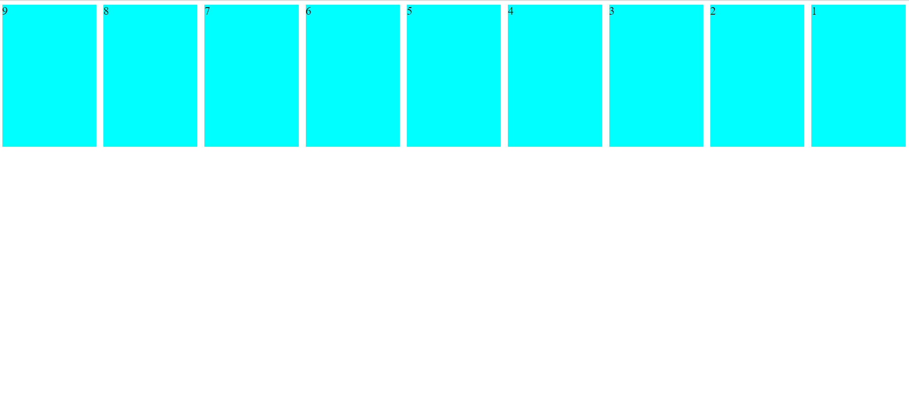

**Contoh Flex Direction `coloumn` :**

```css
.container {
  display: flex;
  flex-direction: column;
}
```

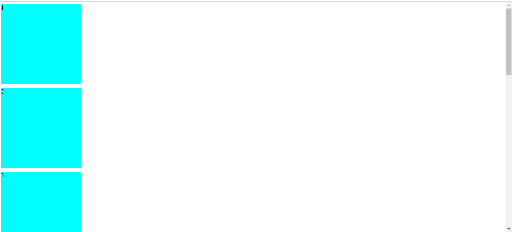

**Contoh Flex Direction `coloumn-reverse` :**

```css
.container {
  display: flex;
  flex-direction: column-reverse;
}
```

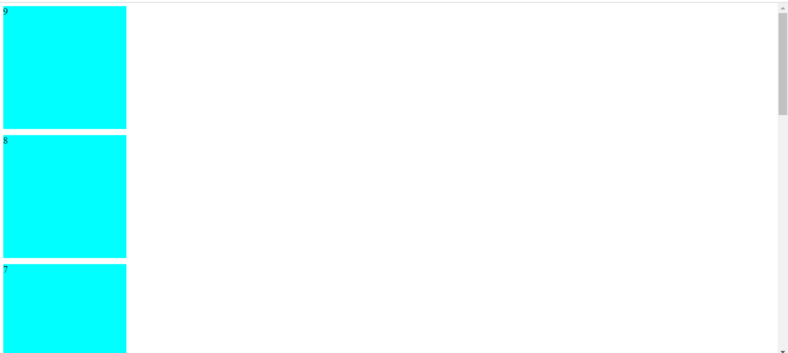

### Justify Content

`flex-start`: Dari kiri ke kanan

`flex-end` : Dari kanan ke kiri

`center` : Ke Tengah

`space-between`

`space-around`

`space-evenly`

**Contoh Flex Direction `flex-end` :**

```css
.container {
  display: flex;
  justify-content: flex-end;
}

.item {
  width: 200px;
  height: 200px;
  background-color: aqua;
  margin: 5px;
}
```

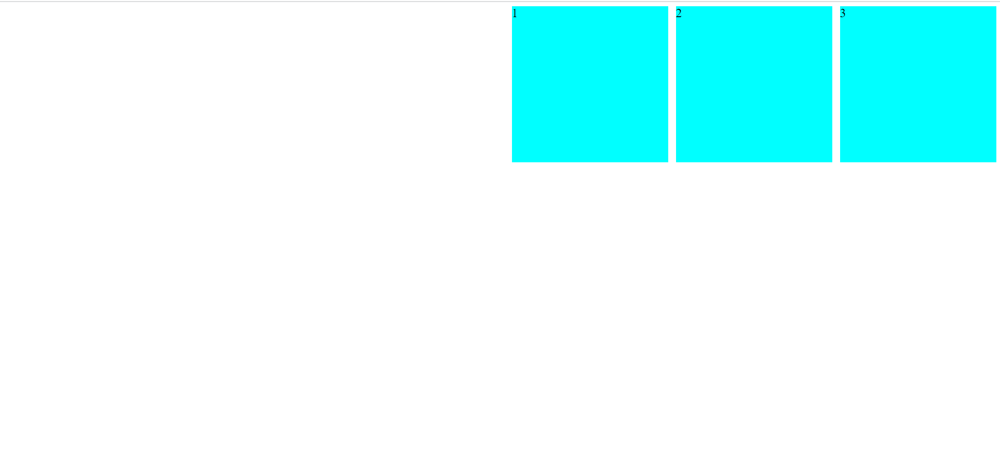

**Contoh Flex Direction `center` :**

```css
.container {
  display: flex;
  justify-content: center;
}
```

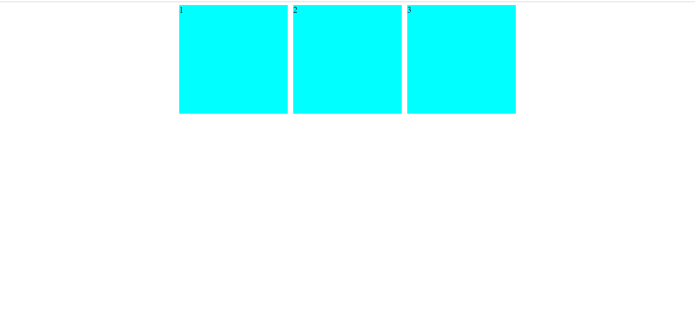

**Contoh Flex Direction `space-around` :**

```css
.container {
  display: flex;
  justify-content: space-around;
}
```

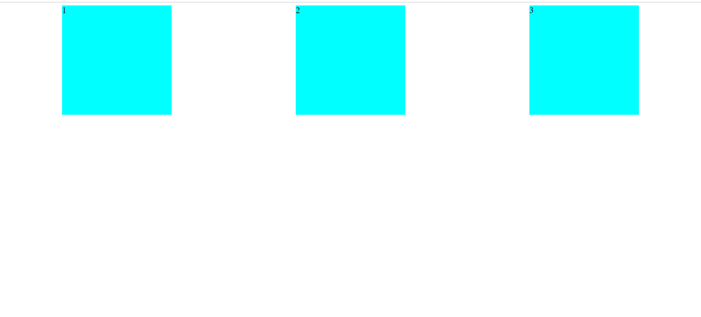

**Contoh Flex Direction `space-between` :**

```css
.container {
  display: flex;
  justify-content: space-between;
}
```

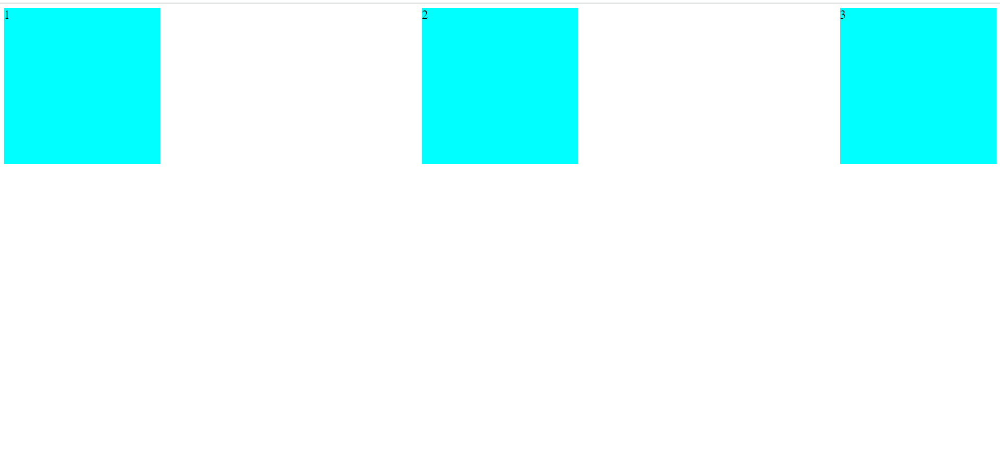

Dan masih banyak contoh penggunaan flexbox lainnya.

## Hari ke - 4 : Algoritma & Struktur Data

### Algoritma

Algoritma adalah deskripsi berupa step-step yang dibutuhkan untuk menyelesaikan suatu masalah

### Struktur Data

Struktur data adalah cara menyimpan dan mengatur data secara terstruktur pada sistem komputer atau database sehingga lebih mudah diakses.

### Kualitas Wajib Algortima

- Input dan output harus didefinisikan terlebih dahulu dengan tepat
- Setiap step harus benar-benar clear dan tidak ambigu
- Algoritma seharusnya tidak mengandung suatu code pada bahasa pemograman tertentu. Algoritma harus dibuat agar dapat digunakan dalam bahasa pemograman apapun.

### Manfaat Algoritma

- Programming itu adalah algoritma dan struktur data
- Data struktur digunakan untuk mengelola/manajemen sebuah data dan Algoritma yang akan menyelesaikan suatu permasalahan menggunakan data tersebut.

### Contoh Algoritma Sederhana

#### Keliling Lingkaran

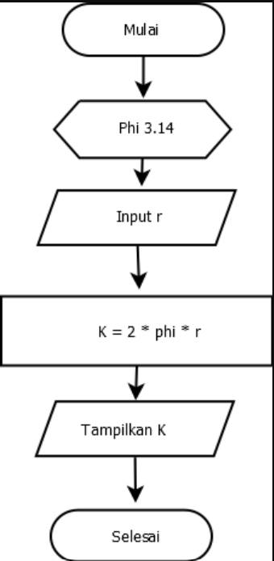

### Algoritma Dalam Pemrograman

Menampilkan Angka 1 sampai 5

```js
for (let i = 1; i <= 5; i++) {
  console.log(i);
}
```

### Penyajian Algoritma

- Deskriptif : Penulisan algoritma secara deskriptif atau dengan cara menjabarkan dengan bahasa sehari-hari
- Flowchart : Penulisan algoritma dengan diagram alur dengan setiap proses diwakili dengan simbol-simbol
- Pseudocode : Penulisan algoritma seperti penulisan bahasa pemrograman tetapi dengan bahasa yang mudah dipahami

### Ciri-ciri Algoritma

- Input : Memiliki 0 atau lebih inputan.
- Output : Memiliki min 1 buah output.
- Effectiveness (tepat dan efisien) : Sebisa mungkin tepat sasaran dan efisien.
- Definiteness (pasti) : Instruksi jelas tidak ambigu.
- Finiteness (ada batas) : Memiliki titik berhenti (stop).

### Penarapan Algoritma dan Struktur data didalam Javascript

Menentukan grade yang didapat oleh Andika jika dia mendapat nilai 40. Dengan ketentuan sebagai berikut :

Jika Nilai 80 sampai 100 Mendapat Score A

Jika Nilai 65 sampai 79 Mendapat Score B

Jika Nilai 50 sampai 64 Mendapat Score C

Jika Nilai 35 sampai 49 Mendapat Score D

Jika Nilai 0 sampai 34 Mendapat Score E

```js
let nama = "Andika",
  nilai = 40;

if (nilai >= 80 && nilai <= 100) {
  console.log(`${nama} mendapat score A`);
} else if (nilai >= 65 && nilai <= 79) {
  console.log(`${nama} mendapat score B`);
} else if (nilai >= 50 && nilai <= 64) {
  console.log(`${nama} mendapat score C`);
} else if (nilai >= 35 && nilai <= 49) {
  console.log(`${nama} mendapat score D`);
} else if (nilai < 35) {
  console.log(`${nama} mendapat score E`);
} else {
  console.log(`Anda Memasukan Nilai yang Salah!`);
}
```

## Hari ke - 5 : Javascript
