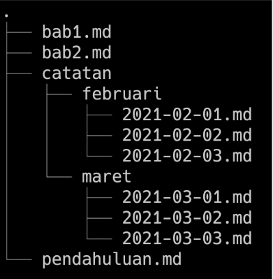

# **_Writing and Presentation Test Week 1_**

---

## Hari ke - 1 : Unix Command Line

### Shell

“Shell” adalah istilah UNIX untuk commnd-line interfaces antara user dan sistem — cara user berinteraksi langsung dengan komputer menggunakan keyboard dan monitor.

### Fungsi Shell

- Menangani file dan direktori
- Membuka dan menutup program
- Mengelola proses komputer
- Menjalankan task berulang

### Command Line

Jenis shell yang berbasis teks

### Command Line Interface (CLI)

Tempat dimana user bisa mengetikkan perintah dalam bentuk teks dan memberikan instruksi pada komputer untuk mengerjakan tugas tertentu.

### Cara Mengakses CLI Menggunakan Terminal

Sebenarnya kita bisa mengakses CLI kita bisa menggunakan **SH**, **ZSH**, **CMD**. Tapi agar lebih mudah disini saya menggunakan **_Git Bash_**.

### File System

Mengatur bagaimana data disimpan didalam sebuah system. OS Windows & Unix-like biasanya menyusun file dan direktori menggunakan struktur yang bentuknya mirip dengan pohon / tree.

**Contoh :**

### Command untuk Navigasi

- `pwd` Print working directory : Command untuk melihat current working directory.
- `ls` Lists : Command untuk melihat isi file yang ada di sebuah direktori.
- `cd` Change Directory : Command untuk berpindah direktori.

### Membuat files & direktori

- `touch` Command untuk membuat sebuah file.
- `mkdir` Command untuk membuat sebuah direktori.

### Melihat isi files

- `head` Command untuk melihat beberapa line awal dari sebuah file text.
- `tail` Command untuk melihat beberapa line awal dari sebuah file text.
- `cat` Command untuk melihat isi sebuah file.

### Menyalin, memindahkan, dan menghapus files & directory

- `cp` Command untuk mengcopy files atau directory
- `cp -R` Command untuk menyalin directory.
- `mv` (move) Command untuk memindahkan files atau directory. Bisa juga digunakan untuk rename.
- `mv -R` Command untuk memindahkan directory
- `rm` Command untuk menghapus file atau directory.
- `rm -R` atau `rm -d` Command untuk menghapus directory.

## Hari ke - 2 : Git & Github Dasar

### Pengenalan Git

- GIT adalah Tools untuk programmer.
- GIT sebagai Version Control System.

  Apa itu Version Control System ? Tugasnya adalah mencatat setiap perubahan pada File (termasuk code yang kita buat) pada suatu proyek baik dikerjakan secara individu maupun tim.

### Git & Github

- **Git** adalah aplikasi yang dapat melacak setiap perubahan yang terjadi pada suatu folder atau file. Git biasanya digunakan oleh para programmer sebagai tempat penyimpanan file pemrograman mereka, karena lebih efektif.

- **Github** adalah situs web juga sebuah layanan cloud yang bisa membantu para pengguna untuk menyimpan,mengelola dan mengembangkan.
