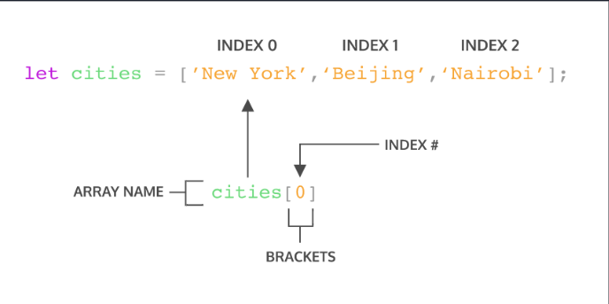

# **_Writing and Presentation Test Week 3_**

## Hari ke - 1 : Javascript Intermediate Array dan Multidimensional Array

## Array

Array adalah tipe data list order yang dapat menyimpan tipe data apapun di dalamnya. Array dapat menyimpan tipe data String, Number, Boolean, dan lainnya.

**Contoh Array :**

```js
let namaMahasiswa = ["naza", "vito", "fakhri", "rizaki"];
console.log(namaMahasiswa);
```

```js
//Array dengan Berbagai Tipe Data
let mahasiswa = ["naza", 303, true];
```

### Membuat Array

Membuat array harus menggunakan kurung siku `[]` atau bisa disebut square bracket.

### Mengakses dan Memanggil Array

Array pada javascript dihitung dari index data ke-0. Data pertama adalah index ke-0.



```js
let toDoList = ["Belajar Javascript", "Makan Siang", "Main Game"];
console.log(toDoList[0]); // Output "Belajar Javascript"
```

### Properti Array

Properties adalah fitur yang sudah disediakan oleh Javascript untuk memudahkan developer.

- `length` akan mengembalikan nilai dari jumlah panjang data suatu array.

```js
let toDoList = ["Belajar Javascript", "Makan Siang", "Main Game"];
console.log(toDoList.length); // 3
```

- `prototype` adalah properti yang digunakan untuk menambahkan method baru.

- `constructor` adalah properti untuk megetahui tipe data array.

```js
let iniArray = ["naza", 8, true];
console.log(iniArray.constructor); // Array() { [native code] }
```

### Method Array

Array memiliki method atau biasa disebut built-in methods. Artinya Javascript sudah memudahkan kita dengan menyediakan function/method umum yang bisa kita gunakan.

- `.push()` adalah method untuk menambahkan item array pada urutan yang paling akhir.

```js
let namaMahasiswa = ["naza", "vito", "fakhri", "rizaki"];
namaMahasiswa.push("Sani");
console.log(namaMahasiswa); // ["naza", "vito", "fakhri", "rizaki","Sani"]
```

- `.pop()` adalah method yang menghapus item array index terakhir.

```js
let namaMahasiswa = ["naza", "vito", "fakhri", "rizaki"];
namaMahasiswa.pop();
console.log(namaMahasiswa); // ["naza", "vito", "fakhri"]
```

- `.shift()` adalah method untuk menghapus item Array pada index pertama.

```js
let namaMahasiswa = ["naza", "vito", "fakhri", "rizaki"];
namaMahasiswa.shift();
console.log(namaMahasiswa); // ["vito", "fakhri", "rizaki"]
```

- `.unshift()` adalah method untuk menambahkan item Array pada index pertama.

```js
let namaMahasiswa = ["naza", "vito", "fakhri", "rizaki"];
namaMahasiswa.unshift("azizah");
console.log(namaMahasiswa); // ["azizah", "naza", "vito", "fakhri", "rizaki"]
```

- `.sort()` adalah method untuk mengurutkan secara Ascending atau Descending Alphanumeric.

```js
const angka = [1, 9, 7, 5, 4];
angka.sort();
console.log(sort); // [1,4,5,7,9]
```

### Looping Array

- `.forEach() ` adalah method untuk melakukan looping pada setiap elemen array.

```js
const namaMahasiswa = ["naza", "vito", "fakhri", "rizaki"];
namaMahasiwa.forEach((element) => {
  console.log(element);
});
// "naza", "vito", "fakhri", "rizaki"
```

- `map()` melakukan perulangan/looping dengan membuat array baru.

```js
let arr = [1, 2, 3, 4, 5];
let double = arr.map((num) => {
  return num * 2;
});
console.log(double);
// 2,4,6,8,10
```

## MultiDimensional Array

Multidimensional Array bisa dianalogikan dengan array of array. Ada array didalam array.

```js
let mahasiswaAktif = [
  ["naza", 303, true],
  ["fakhri", 303, true],
  ["vito", 304, true],
];
console.log(mahasiswaAktif[0][1]); // output 303
```

Sama seperti array satu dimensi, multidimensional array juga dapat menggunakan Property dan Method built-in Array.

```js
let mahasiswaAktif = [
  ["naza", 303, true],
  ["fakhri", 303, true],
  ["vito", 304, true],
];
mahasiswaAktif.push(["rizaki", 303, true]);
console.log(mahasiswaAktif);
//Output
// [
//   ["naza", 303, true],
//   ["fakhri", 303, true],
//   ["vito", 304, true],
//   ["rizaki", 303, true],
// ];
```

## Hari ke - 2 : Javascript Intermediate Object

Dalam kehidupan nyata, kita sebenarnya sudah sering menjumpai object. Entah itu benda mati atau benda hidup. Semuanya adalah object. Object didunia nyata dapat kita modelkan didalam programming. Jadi pada programming, object adalah sebuah tipe data pada variabel yang menyimpan properti dan fungsi (method).

> Properti adalah data lengkap dari sebuah object.

> Method adalah action dari sebuah object. Apa saja yang dapat dilakukan dari suatu object.

### Membuat Object

Kalau Array Menggunakan Kurung Siku `[]` nah kalau Object menggunakan kurung kurawal `{}`.

```js
let person = {};
```

### Mengakses Object

```js
let person = {
  nama: "naza",
  umur: 20,
  kelas: 303,
  asal: "jakarta",
};
console.log(person); // { nama: "naza" umur: 20 kelas: 303 asal: "jakarta"}
```

### Mengakses Properti Object dengan Dot Notation

```js
let person = {
  nama: "naza",
  umur: 20,
  kelas: 303,
  asal: "jakarta",
};
console.log(person.nama); // "naza"
```

### Mengakses Properti Object dengan Bracket Notation

```js
let person = {
  nama: "naza",
  umur: 20,
  kelas: 303,
  asal: "jakarta",
};
console.log(person["umur"]); // 20
```

### Menambah Properti Object Baru

```js
let person = {
  nama: "naza",
  umur: 20,
  kelas: 303,
  asal: "jakarta",
};

person.status = "aktif"; // Dot Notation
person["status"] = "aktif"; // Bracket Notation

console.log(person);
```

### Mengganti Properti Object

```js
let person = {
  nama: "naza",
  umur: 20,
  kelas: 303,
  asal: "jakarta",
};

person.nama = "zulfiqi";
console.log(person);
```

### Menghapus Properti Object

```js
let person = {
  nama: "naza",
  umur: 20,
  kelas: 303,
  asal: "jakarta",
};

delete person.name;
console.log(person);
```

### Object Method

```js
const greeting = {
  welcome: () => {
    console.log("Selamat Datang");
  },
  afterPay: () => {
    console.log("Terimakasih");
  },
};
console.log(greeting.nama()); // Selamat Datang
```

### Nested Object

Nested Object adalah Object didalam Object.

```js
let asistenAktif = {
  lab: "Sistem Informasi",
  status: "Aktif",
  anggota: {
    profile1: {
      nama: "naza",
      umur: 20,
      asal: "jakarta",
    },
    profile2: {
      nama: "fakhri",
      umur: 21,
      asal: "tangerang",
    },
  },
};

console.log('Nama Saya ' asistenAktif.anggota.profile1.nama);
// 'Nama Saya naza'
```

### Looping Object

**Syntax Sederhana :**

```js
for (let key in object) {
  //..
}
```

**Contoh :**

```js
let asistenAktif = {
  lab: "Sistem Informasi",
  status: "Aktif",
  anggota: {
    profile1: {
      nama: "naza",
      umur: 20,
      asal: "jakarta",
    },
    profile2: {
      nama: "fakhri",
      umur: 21,
      asal: "tangerang",
    },
  },
};

for (let key in asistenAktif) {
  console.log(asistenAktif[key]);
}
// Output:
// Sistem Informasi
// Aktif
// {profile1: {…}, profile2: {…}}

for (let anggota in asistenAktif.anggota.profile1) {
  console.log(asistenAktif.anggota.profile1[anggota]);
}

// Output:
// naza
// 20
// jakarta
```

### Array Object

```js
let listMahasiswa = [
  {
    nama: "naza",
    umur: 20,
    asal: "jakarta",
  },
  {
    nama: "fakhri",
    umur: 21,
    asal: "tangerang",
  },
];

listMahasiswa.forEach((mahasiswa) => {
  console.log(mahasiswa);
});
// Output
// {nama: 'naza', umur: 20, asal: 'jakarta'}
// {nama: 'fakhri', umur: 21, asal: 'tangerang'}
```

## Hari ke - 3 : Javascript Recursive

Recursive adalah function yang memanggil dirinya sendiri sampai kondisi tertentu. Recursive kebanyakan digunakan untuk case matematika, fisika, kimia, dan yang berhubungan dengan calculation.

### Struktur Recursive

```js
function recursive() {
  //..
  recursive();
  //..
}
```

Recursive akan berhenti memanggil dirinya sendiri jika kondisi terpenuhi

```js
function recursive() {
  if (condition) {
    //..stop calling itself
    //..
  } else {
    recursive();
  }
}
```

### Ciri Recursive

- Fungsi rekursif selalu memiliki kondisi yang menyatakan kapan fungsi tersebut berhenti. Kondisi ini harus dapat dibuktikan akan tercapai, karena jika tidak tercapai maka kita tidak dapat membuktikan bahwa fungsi akan berhenti, yang berarti algoritma kita tidak benar.

- Fungsi rekursif selalu memanggil dirinya sendiri sambil mengurangi atau memecahkan data masukan setiap panggilannya. Hal ini penting diingat, karena tujuan utama dari rekursif ialah memecahkan masalah dengan mengurangi masalah tersebut menjadi masalah-masalah kecil.

**Contoh Kasus Fungsi rekursif menghitung mundur number**

```js
function countDown(fromNumber) {
  console.log(fromNumber);

  let nextNumber = fromNumber - 1;

  if (nextNumber > 0) {
    return countDown(nextNumber);
  }
}

countDown(3);
// 3 2 1
```

**Contoh Kasus Mencari hasil dari nilai pangkat dengan rekursif**

```js
function pow(x, n) {
  if (n == 1) {
    return x;
  } else {
    return x * pow(x, n - 1);
  }
}

console.log(pow(2, 10));
//1024
```

## Hari ke - 4 : Javascript Asynchronous & Asynchronous Promise

## Asynchronus

Pemrograman Asynchronus adalah teknik yang memungkinkan program Anda untuk memulai tugas yang berpotensi berjalan lama dan masih dapat responsif terhadap peristiwa lain saat tugas itu berjalan, daripada harus menunggu sampai tugas itu selesai. Setelah tugas itu selesai, program Anda disajikan dengan hasilnya.

## Synchronus

Synchronous adalah saat kita mengeksekusi perintah satu persatu dan berurutan.

**Contoh Penggunaan Asynchronus**

```js
setTimeout(() => {
  console.log("Aku Naza");
}, 1000);
console.log("Zulfiqi");
//Ouput "Zulfiqi" "Aku Naza"
```

Mengapa menampilkan `Zulfiqi` terlebih dahulu? Karena program diatas adalah Asynchronus yang dimana ia akan memproses kode yang tidak ada setWaktu nya dalam kasus diatas adalah `Aku Naza` mempunya setWaktu selama 1000ms / 1 Detik.

## Cara Menjalakan Asynchronus

- Callback
- Promise
- Asyn aWait

### Callback

Callback adalah sebuah fungsi yang digunakan sebagai argumen pada fungsi lain. Fungsi ini dieksekusi setelah fungsi utamanya selesai dieksekusi atau bisa disebut menunggu fungsi utamanya selesai baru menjalankan fungsi selanjutnya.

```js
function namaSaya(iniCallBack) {
  setTimeout(() => {
    console.log("Naza");
    iniCallBack();
  }, 1000);
}
namaSaya(() => {
  console.log("Zulfiqi");
});
// Naza
// Zulfiqi
```

### Promise

```js
let newPromise = new Promise((resolve, reject) => {
  if (true) {
    resolve("Berhasil");
  } else {
    reject("Gagal");
  }
});

console.log(newPromise);
//Promise {<fulfilled>: 'Berhasil'}
```

`resolve` : parameter yang digunakan ketika Promise berhasil.

`reject` : parameter yang digunakan ketika Promise gagal.

## Hari ke - 5 : Javascript Web Storage

Objek localStorage dan sessionStorage, bagian dari API penyimpanan web, adalah dua alat hebat untuk menyimpan pasangan kunci/nilai secara lokal. Menggunakan localStoragedan sessionStorageuntuk penyimpanan adalah alternatif untuk menggunakan cookie dan ada beberapa keuntungan:

- Data hanya disimpan secara lokal dan tidak dapat dibaca oleh server, yang menghilangkan masalah keamanan yang disebabkan oleh cookie.

- Ini memungkinkan lebih banyak data disimpan (10mb untuk sebagian besar browser).

**Contoh Key dan Value Menyimpan Data**

```js
localStorage.setItem("nama", "Naza");
sessionStorage.setItem("nama", "Fakhri");
```

**Contoh Menghapus Data**

```js
// menghapus key tertentu
localStorage.removeItem("key");
sessionStorage.removeItem("key");

// menghapus semua key
localStorage.clear();
sessionStorage.clear();
```

**Contoh Mengambil Data**

```js
localStorage.getItem("key");
sessionStorage.getItem("key");
```
