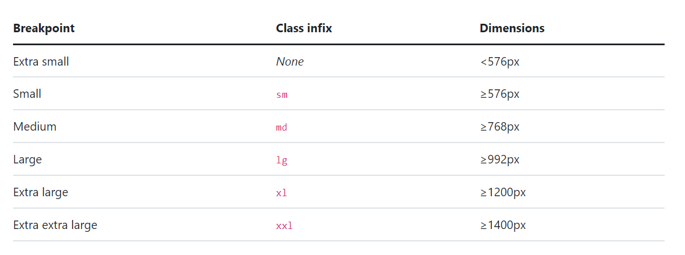
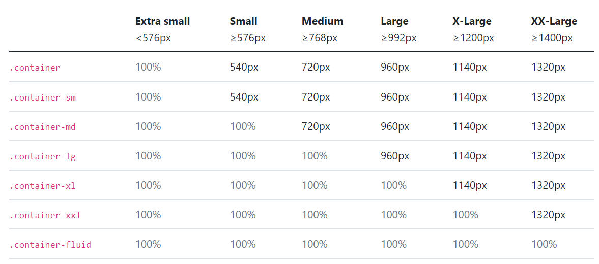
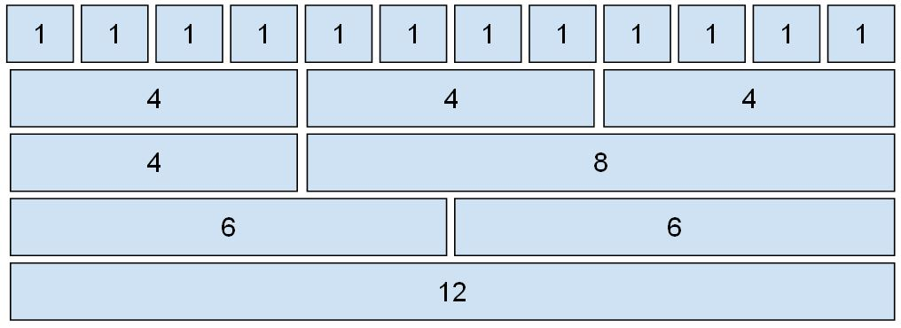

# **_Writing and Presentation Test Week 4_**

## Javascript Intermediate Asynchronus

### Async Await

Selain menggunakan promise kita juga dapat menggunakan **Async Await**. Apa itu Async Await? Async/await adalah fitur yang hadir sejak ES2017. Fitur ini mempermudah kita dalam menangani proses asynchronous.Async/Await merupakan sebuah syntax khusus yang digunakan untuk menangani Promise agar penulisan code lebih efisien dan rapih.

**Contoh Syntax Async Await:**

```js
async function asyncNonton() {
  try {
    let result = await nonton();
    console.log(result);
  } catch (error) {
    console.log(error);
  }
}

asyncNonton();
```

**Selengkapnya :**

```js
let nonton = (kondisi) => {
  return new Promise((resolve, reject) => {
    if (kondisi == "jalan") {
      resolve("Jadi Nonton");
    }
    reject("Gajadi Nonton");
  });
};

async function asyncNonton() {
  try {
    let result = await nonton();
    console.log(result);
  } catch (error) {
    console.log(error);
  }
}

asyncNonton();
```

`async` mengubah function menjadi asynchronous.

`await` menunda eksekusi hingga proses asynchronous selesai.

### Fetch API

Sebelum ke bagian Fetch API Kita harus tau dulu API itu apa. API atau application programming interface adalah sebuah interface yang bisa menghubungkan dua atau lebih aplikasi secara bersamaan dan membuat pemrograman jauh lebih mudah. Contohnya, kode pemrograman ini dapat Anda terapkan untuk menghubungkan Booking Management Platform dengan perusahaan penyedia layanan.

Fetch API pada javascript adalah kegiatan untuk meminta/request layanan ke endpoint/letak url yang akan menerima request pada website secara local maupun public, untuk mengambil response resource / sumber daya berupa data berformat json atau text yang biasa dilakukan programmer untuk membangun website yang membutuhkan data dari website lain ataupun website yang membutuhkan konsep microservice didalamnya.

**Contoh Syntax Fetch API :**

```js
fetch(
  "https://api.themoviedb.org/3/discover/movie?api_key=78dec1f8e721c138fea01530c676d001&sort_by=popularity.desc"
)
  .then((result) => result.json())
  .then((result) => {
    console.log(result);
  });
```

## Git & Github Lanjutan

### Git

Git adalah perangkat lunak pengendali versi atau proyek manajemen kode perangkat lunak yang diciptakan oleh Linus Torvalds, yang pada awalnya ditujukan untuk pengembangan kernel Linux.

### Github

GitHub adalah layanan hos web bersama untuk proyek pengembangan perangkat lunak yang menggunakan sistem kendali versi Git dan layanan hosting internet. Hal ini banyak digunakan untuk kode komputer.

#### Command Pada Git

- `git branch` untuk melihat ada branch/cabang apa saja didalam repo tersebut.
- `git branch dev` untuk membuat branch/cabang dev.
- `git log` untuk melihat hasil commit sebelumnya.
- `git checkout` untuk berpindah commit menggunakan hash atau berpindah branch.
- `git reset` untuk merubah commit dan menghapus commit sebelumnya.
- `git revert` untuk membatalkan perubahan yang terjadi di git tanpa menghapus git commit sebelumnya.
- `fork` untuk mengambil repository orang lain dan diletakan ke repository kita.
- `clone` untuk menduplikat repo dari github ke local storage kita.

#### Kolaborasi di Github

1. Buat Organisasi didalam Github.
2. Undang anggota tim.
3. Buat Repository.
4. Tambahkan Branch Dev (Best Practice).
5. Anggota Tim clone repo tersebut.
6. Bagi tugas dan buat branch masing-masing anggota.

## Responsive Web Design Dan Bootstrap

Responsive Web Design (RWD) bertujuan untuk membuat website kita dapat diakses dalam device apapun. Device yang digunakan biasanya ada smartphone, tablet dan desktop.

### Responsive Web Desing

#### Tag Meta

```html
<meta name="viewport" content="width=device-width, initial-scale=1.0" />
```

#### Max Width Css

```css
max-width: 100%;
```

### Media Query

```css
@media screen and (min-width: 350px) {
  /* ..... */
}

@media screen and (max-width: 1200px) {
  /* ..... */
}
```

### Bootstrap

Bootstrap adalah kerangka kerja CSS yang sumber terbuka dan bebas untuk merancang situs web dan aplikasi web. Kerangka kerja ini berisi templat desain berbasis HTML dan CSS untuk tipografi, formulir, tombol, navigasi, dan komponen antarmuka lainnya, serta juga ekstensi opsional JavaScript. Bootstrap biasa disebut framwork css.

### Menggunakan Bootstrap

Kita dapat menggunakan bootstrap dengan beberapa cara yaitu didownload secara offline dan menggunakan CDN Link. Disini saya menggunakan CDN Link.

```html
<link
  href="https://cdn.jsdelivr.net/npm/bootstrap@5.2.2/dist/css/bootstrap.min.css"
  rel="stylesheet"
  integrity="sha384-Zenh87qX5JnK2Jl0vWa8Ck2rdkQ2Bzep5IDxbcnCeuOxjzrPF/et3URy9Bv1WTRi"
  crossorigin="anonymous"
/>
<script
  src="https://cdn.jsdelivr.net/npm/bootstrap@5.2.2/dist/js/bootstrap.bundle.min.js"
  integrity="sha384-OERcA2EqjJCMA+/3y+gxIOqMEjwtxJY7qPCqsdltbNJuaOe923+mo//f6V8Qbsw3"
  crossorigin="anonymous"
></script>
```

### Layout

#### Breakpoints

Bootstrap menyertakan enam breakpoint default, terkadang disebut sebagai grid tiers , untuk membangun secara responsif. Breakpoint ini dapat dikustomisasi jika Anda menggunakan file Sass.



#### Container

Container adalah elemen tata letak paling dasar di Bootstrap dan diperlukan saat menggunakan sistem grid default kami . Container digunakan untuk menampung, melapisi, dan (terkadang) memusatkan konten di dalamnya. Meskipun container dapat disarangkan, sebagian besar tata letak tidak memerlukan container bersarang.



#### Grid & Column

Grid didalam bootstrap dibagi menjadi 12 Column.


